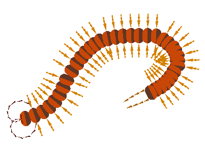

# Lab 4
**Refer to the initial commit history for code that was provided by [Prof. Cheng](https://www.comp.nus.edu.sg/cs/people/hcheng/)**

## Comments
- Not enough time...
- Attempted to draw a centipede

## Final doodle


## Running (Windows)
- Run `x64 Native Tools Command Prompt for VS 2019` as administrator
- Run the following:
```
cl main.cpp /I"include" /link lib/freeglut.lib opengl32.lib glu32.lib
```
- Lastly run `main.exe`
