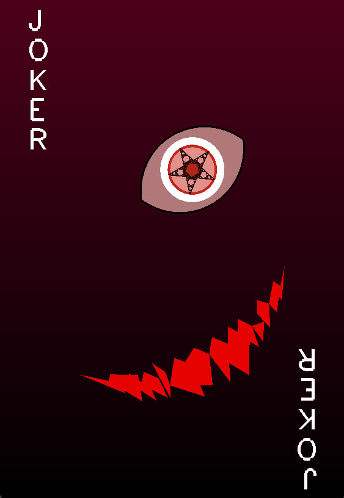

# Lab 1
## Comments
- The eyes were generated using the intersection of two circles. `glStencil` related methods were used.
- The iris was inspired by The Chaos Game with the algorithm [adapted from here](https://fronkonstin.com/tag/fractals/)
  - If there was more time, color gradients on the eyes itself would have been nice.
- The mouth was hardcoded with polygons one at a time...

## Final doodle

